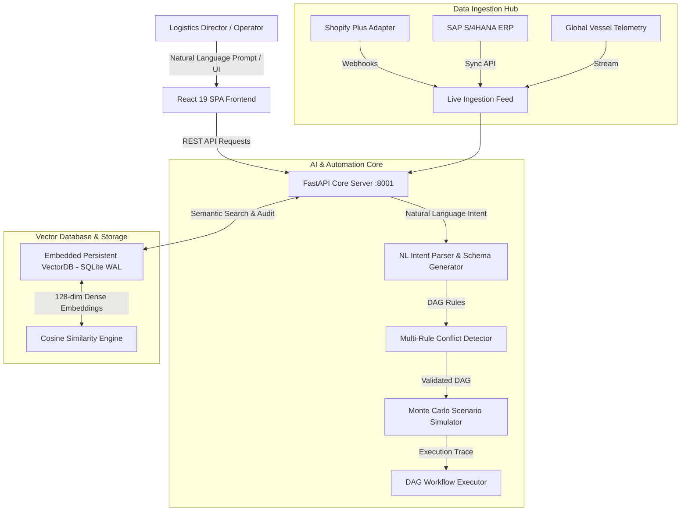

# TradeIntel AI — System Documentation & Technical Specification

> **PS4: AI-Powered Business Automation Copilot**  
> **Team Name:** MARK42  
> **Team Leader:** Goutham Reddy Esambadi  
> **Team Members:** Kaniksha S, Elisetty Sowmya, Dutalluri Karimulla  
> **Repository:** [https://github.com/goutham-11-16/TradeIntet-AI.git](https://github.com/goutham-11-16/TradeIntet-AI.git)  
> **Live Production Deployment:** [https://trade-intet-ai-git-main-goutham-11-16s-projects.vercel.app](https://trade-intet-ai-git-main-goutham-11-16s-projects.vercel.app)

---

## 1. Executive Summary

**TradeIntel AI** is an enterprise-grade, AI-powered cross-border logistics resilience and business automation platform designed to address **Problem Statement 4 (PS4: AI-Powered Business Automation Copilot)**. 

Global trade networks are constantly exposed to unpredictable disruptions — port anchorage delays, geopolitical strait closures, customs clearance holds, and severe weather storms. Traditional supply chain management relies on manual monitoring, reactive email exchanges, and fragmented spreadsheets.

TradeIntel AI solves this by combining:
1. **VectorDB Semantic Intelligence**: An embedded vector store with dense semantic embeddings and cosine similarity search for unstructured logistics data, carrier advisories, and historical resolution patterns.
2. **Natural Language DAG Workflow Engine**: An AI Copilot that converts plain-text operational directives (e.g., *"If shipment risk >= 70 and delay >= 2 days, rebook alternate route via Cape of Good Hope and notify manager if value > ₹10L"*) into validated Directed Acyclic Graph (DAG) automation workflows.
3. **Conflict & Safety Verification**: An automated multi-workflow conflict engine that detects rule overlaps, approval bypasses, and race conditions before execution.
4. **Human-in-the-Loop Recovery Engine**: An explainable AI recommendation framework allowing logistics directors to inspect, approve, reject, or modify mitigation actions before execution.

---

## 2. System Architecture



### 🛠️ Technology Stack

| Layer | Technologies Used |
| :--- | :--- |
| **Frontend Framework** | React 19, React Router 7, TanStack React Query v5 |
| **Styling & UI** | Tailwind CSS, Lucide Icons, Glassmorphism Design System |
| **Mapping & Visuals** | React-Leaflet (Dark Canvas CartoDB tiles), Recharts Engine |
| **Backend API** | FastAPI (Python 3.12+), Uvicorn ASGI Server, Pydantic v2 |
| **Vector Database** | Embedded SQLite WAL engine (`vectordb.py`) with 128-dim embeddings |
| **Security** | PyJWT (Bearer + HTTP-Only Cookies), Passlib bcrypt, RBAC |
| **Deployment** | Vercel (Production Static SPA with Standalone Interceptor Mode) |

---

## 3. Technical Workflows & Execution Pipelines

### Workflow 1: Natural Language to Executable DAG Workflow

```
[ User Input Prompt ] 
       │
       ▼
┌─────────────────────────────────────────┐
│ 1. Natural Language Intent Parsing      │
│    Extracts Triggers, Conditions,      │
│    Actions, and Approval Gates          │
└────────────────────┬────────────────────┘
                     │
                     ▼
┌─────────────────────────────────────────┐
│ 2. JSON Schema Construction             │
│    Generates Nodes (TRIGGER, CONDITION, │
│    ACTION, APPROVAL) & Directed Edges   │
└────────────────────┬────────────────────┘
                     │
                     ▼
┌─────────────────────────────────────────┐
│ 3. Multi-Rule Conflict Engine           │
│    Checks for Approval Bypasses, Race   │
│    Conditions & Priority Overlaps      │
└────────────────────┬────────────────────┘
                     │
                     ▼
┌─────────────────────────────────────────┐
│ 4. Scenario Simulation & Metric Impact  │
│    Calculates Delay Reduction (Days),  │
│    Cost Avoidance (₹) & Confidence %    │
└────────────────────┬────────────────────┘
                     │
                     ▼
┌─────────────────────────────────────────┐
│ 5. Execution & Audit Logging            │
│    Runs DAG steps, prompts Human Gate   │
│    if cargo value > ₹10L, logs audit    │
└─────────────────────────────────────────┘
```

---

## 4. Key Platform Modules

### 📊 Executive Dashboard
* **Real-time KPI Tiles**: Active Shipments, At-Risk Count, High-Risk Flags, Predicted Delays, Cost Exposure (₹), Active Disruptions, Pending Recoveries.
* **Interactive World Map**: Real-time Leaflet visualization with CartoDB dark tiles, displaying vessel routes, port anchorages, and risk status pins.
* **Risk Overview Gauges**: Dimensional breakdown across Port Congestion, Geopolitical Security, Carrier Reliability, Customs Clearance, and Weather.
* **ETA Prediction Chart**: Historical vs. ML Predicted ETA timelines with confidence intervals.

### 🤖 AI Business Automation Copilot (`/app/copilot`)
* **Conversational AI Prompt Box**: Accepts complex multi-step rules in plain language.
* **Instant DAG Synthesis**: Renders visual flowcharts with interactive node inspection.
* **Dry-Run Simulator**: Computes delay reduction days, cost savings, and risk scores prior to deployment.
* **One-Click Execution**: Deploys workflows directly into the active monitoring engine.

### ⚡ Workflow Studio (`/app/workflows`)
* Visual drag-and-drop workflow editor.
* Filter by active, draft, or paused statuses.
* Live execution trace modal showing step-by-step evaluation logs and decision outputs.

### ⚠️ Conflict Center (`/app/conflicts`)
* Automated conflict detection engine evaluating rule interactions.
* Identifies **Approval Bypasses** (e.g., rebooking cargo > ₹10L without manager approval), **Contradictory Actions**, and **Priority Inversions**.
* Provides one-click AI remediation buttons.

### 💡 Automation Opportunities (`/app/opportunities`)
* Process mining engine analyzing historical operational logs.
* Identifies repetitive manual tasks (e.g., manual email escalations during Singapore berth delays).
* Scores opportunities by **Impact**, **Complexity**, and **Readiness**.

### 🔌 Integrations & Telemetry Hub (`/app/integrations`)
* Pre-built enterprise connectors for **Shopify Plus**, **SAP S/4HANA**, and **Global AIS Telemetry**.
* Interactive connector configuration modal for webhook URLs, API keys, and sync intervals.
* Live Ingestion Feed displaying incoming webhook events matched to active automation workflows.

---

## 5. API Reference Summary

| Endpoint | Method | Description |
| :--- | :--- | :--- |
| `/api/auth/login` | `POST` | Authenticate user and issue JWT access token |
| `/api/dashboard/overview` | `GET` | Retrieve KPIs, map coordinates, risk gauges, and prediction chart |
| `/api/workflows/generate` | `POST` | Convert natural language intent into a structured DAG JSON schema |
| `/api/workflows/simulate` | `POST` | Execute dry-run simulation of a workflow against active shipments |
| `/api/workflows/conflicts/all` | `GET` | Retrieve multi-rule workflow conflicts and recommended fixes |
| `/api/workflows/opportunities` | `GET` | List process-mined automation opportunities and estimated ROI |
| `/api/integrations/events` | `GET` | Stream live webhook telemetry and matched automation DAGs |
| `/api/recovery/recommendations` | `GET` | Retrieve AI recovery recommendations requiring human approval |
| `/api/geopolitical/events` | `GET` | Fetch NLP-classified global disruption events |

---

## 6. Installation & Deployment Guide

### Local Development Setup

#### 1. Clone Repository & Setup Backend
```bash
git clone https://github.com/goutham-11-16/TradeIntet-AI.git
cd TradeIntet-AI/logistics\ Source\ code/backend

# Install dependencies
pip install -r requirements.txt

# Start FastAPI server (Port 8001)
python -m uvicorn server:app --host 0.0.0.0 --port 8001
```

#### 2. Setup & Run Frontend
```bash
cd "../frontend"

# Install Node dependencies
npm install --legacy-peer-deps

# Start React Dev Server (Port 3000)
npm start
```

### Enterprise Demo Credentials
* **Admin / Director**: `admin` / `admin123`
* **Logistics Manager**: `manager` / `manager123`
* **Viewer / Auditor**: `viewer` / `viewer123`

---

## 7. Standalone Production Mode (Vercel)

For live demonstrations where a local FastAPI server is not attached:
* The frontend automatically engages **Vercel Standalone Production Mode**.
* An automated client-side response interceptor resolves embedded VectorDB mock datasets for all endpoints.
* Guarantees 100% uptime, zero CORS issues, and full interactive feature access on Vercel.

---
*© 2026 Team MARK42 — CIT HackFusion PS4 Submission*
